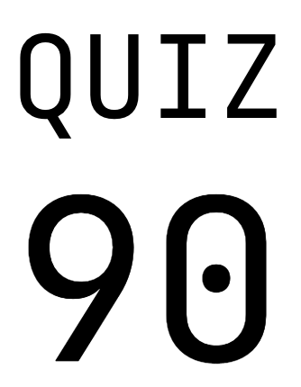
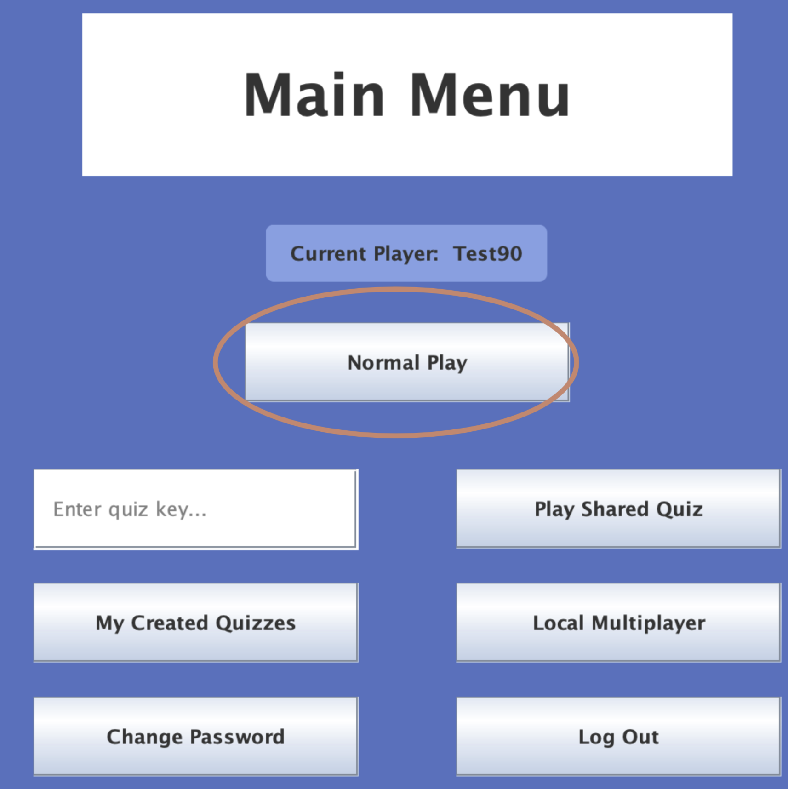
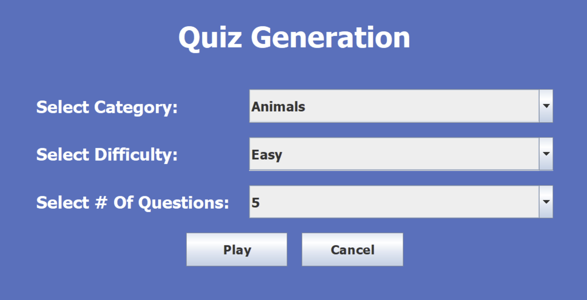
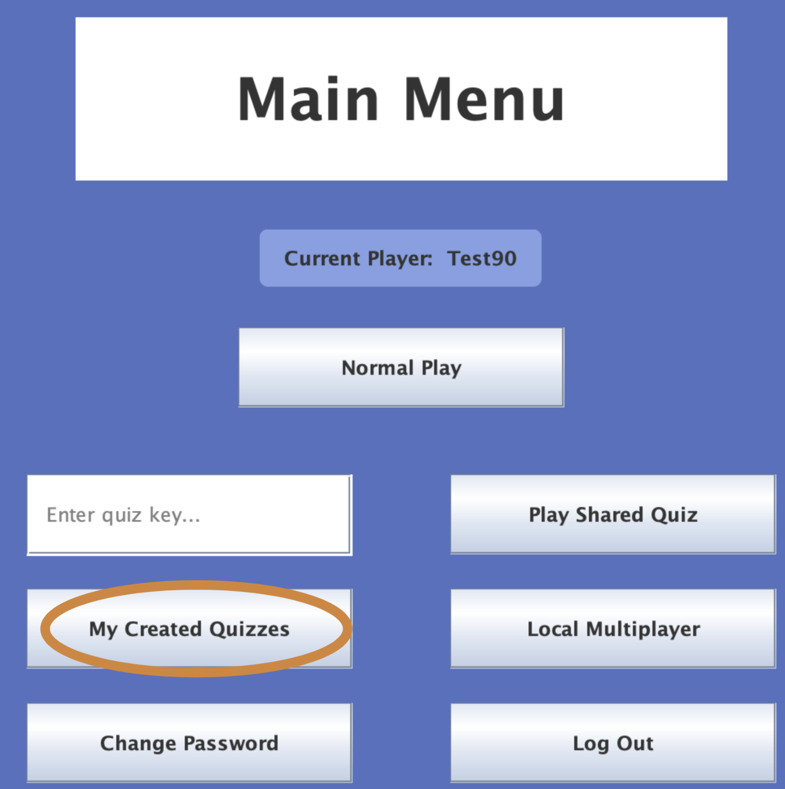
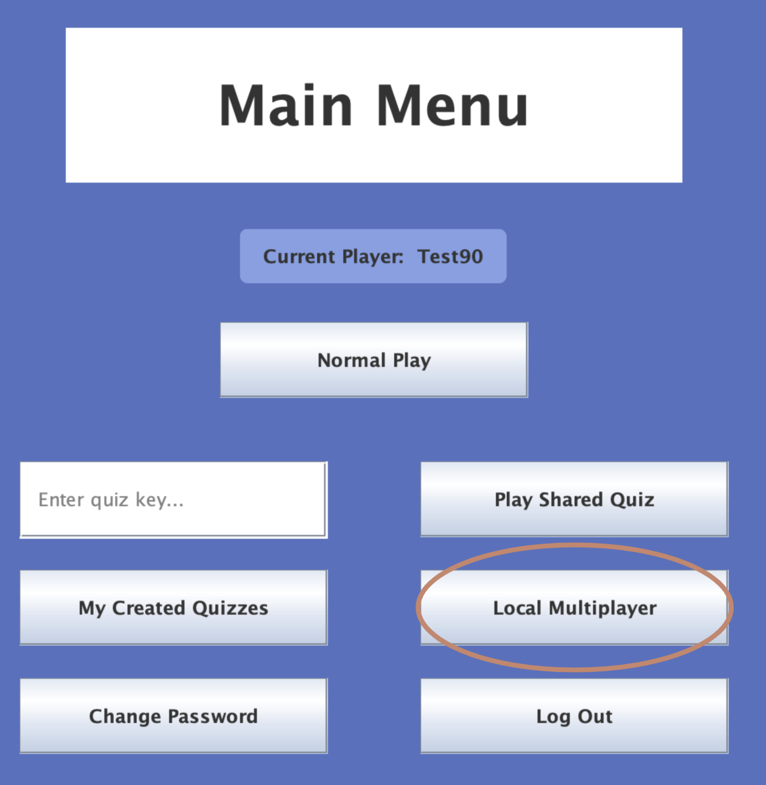
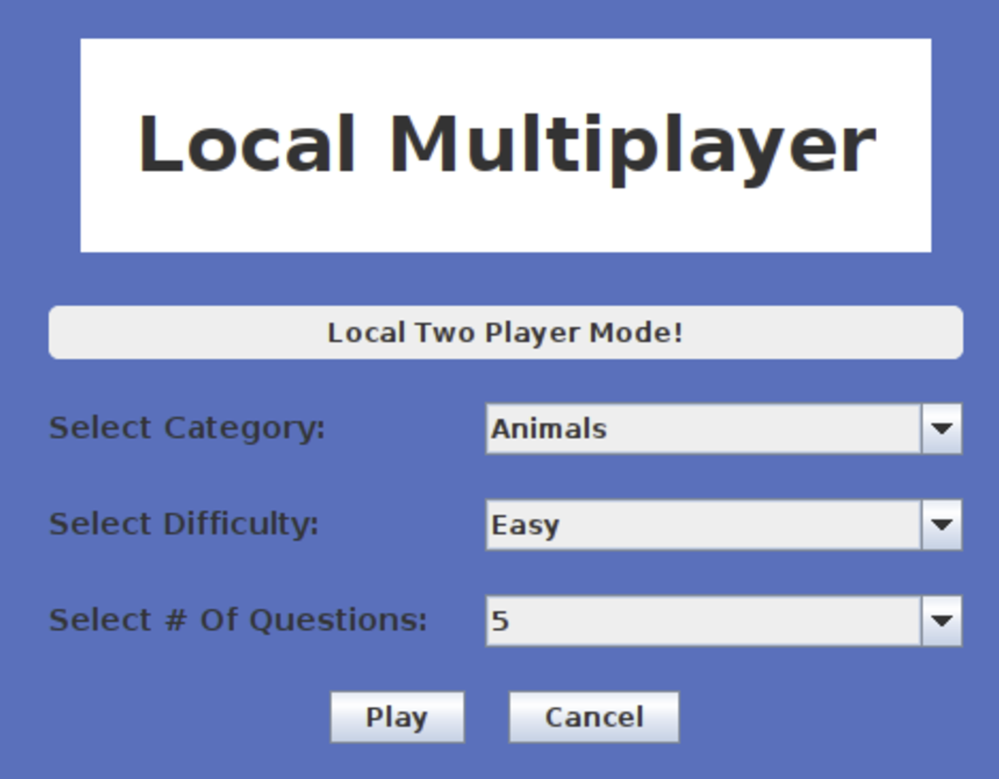
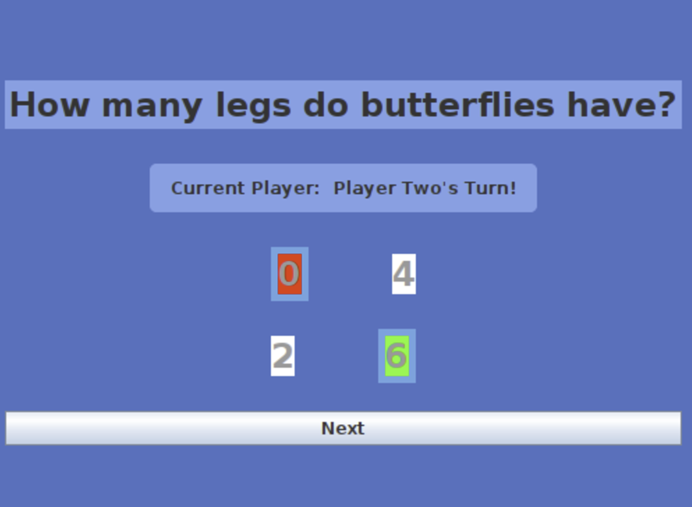
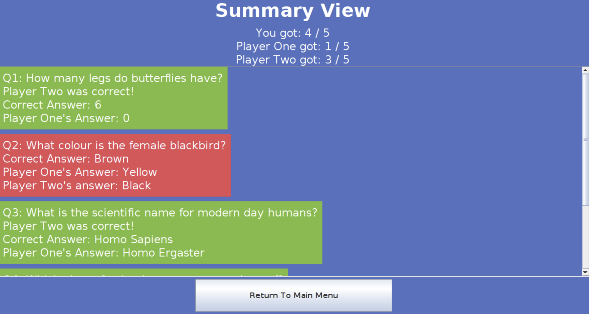

This repository is a fork of https://github.com/Aref-Mal/Quiz90/ after completion. My individual contributions were key input functionality, quiz access from API, and custom quiz creation. My team contributions were assisting with quiz playthrough logic, the README, and UIs (creating views and connecting them to each other). Detailed contributions can be found in the commit history, and in the issues tab of the original repo.

# Quiz 90 

## Contributors 👬
- **Liam Huynh** liam.huynh
- **Aakaash Rohra** aakrohra
- **Aref Malekanian** Aref-Mal
- **Albert Jun** Albert-Jun
- **Tin Chak Justin Yuen** palteofdough

## Summary 📃
**Domain Idea**: Trivia quiz playability, creation, and sharing

 - A trivia quiz game where users can play pre-built quizzes or create and share their own trivia quizzes with a scoring system

## Table of Contents
<!-- TOC -->
* [Quiz 90](#quiz-90-)
  * [Contributors 👬](#contributors-)
  * [Summary 📃](#summary-)
  * [Table of Contents](#table-of-contents)
  * [Key features 🔑](#key-features-)
    * [Grade API (documentation)](#grade-api--documentation-)
    * [Open TriviaDB (documentation)](#open-triviadb--documentation-)
  * [Installation instructions 💠](#installation-instructions-)
  * [Usage Guide 🦮](#usage-guide-)
    * [Logging in & Signning up](#logging-in--signning-up)
    * [Generating a random quiz via the Open TriviaDB API and playing it](#generating-a-random-quiz-via-the-open-triviadb-api-and-playing-it)
    * [Playing a shared quiz using a key](#playing-a-shared-quiz-using-a-key)
    * [Visting & using your quiz database](#visting--using-your-quiz-database)
      * [Searching for a quiz via title](#searching-for-a-quiz-via-title)
      * [Searching for a quiz via key](#searching-for-a-quiz-via-key)
      * [Creating a quiz](#creating-a-quiz)
      * [Local multiplayer](#local-multiplayer)
  * [License 🪪](#license-)
  * [How to give feedback 🗣️](#how-to-give-feedback-)
  * [Contributions 🤝](#contributions-)
<!-- TOC -->

## Key features 🔑
- Create quizzes with multiple-choice questions
- Share/access created quizzes via unique keys
- Local multiplayer - two people play on the same laptop, taking turns answering questions, with the ability to steal
- Play quizzes using trivia questions from an external API (OpenTDB)
- Store user accounts and trivia questions using the Grade API
- Track user scores and progress in the game 
### Grade API [(documentation)](https://www.postman.com/cloudy-astronaut-813156/csc207-grade-apis-demo/overview)
- **Services provided**: user account management and storage for user-generated quizzes
- **Usage**: store player data and trivia quizzes
### Open TriviaDB [(documentation)](https://opentdb.com/api_config.php)
- **Services provided**: fetch trivia questions from a large database based on category, difficulty, and type
- **Usage**: retrieve sets of trivia questions for games

## Installation instructions 💠
**Prerequisites**
- Java development kit (JDK), minimum version: 17+ [(download)](https://www.oracle.com/java/technologies/downloads/?er=221886)
- Maven
Download project files and images 

## Usage Guide 🦮
To run the program, run the Main.java file. You can find this via src/main/java/app/Main.java.

### Logging in & Signing up
If you don’t have an account, input a username and password in the required fields, then press the “Sign up” button. This will take you to the login page, where you can follow the below actions to log in.

If you have an account, navigate to the login page via the “Go to Login” button on the signup page. Input your username and password, then click “Log In”.

Once you logged in, you will be directed to the main menu. From here, you have multiple options.

### Generating a random quiz via the Open TriviaDB API and playing it

Click on the "Normal Play" button as shown above. This will bring you to a quiz generation screen.

To select a category, click on the dropdown box next to the “Select Category”  label and choose a category.

To select a difficulty, click on the dropdown box next to the “Select Difficulty” label and choose a difficulty.

To select the number of questions, click on the dropdown box next to the “Select # of Questions” label and choose the number of questions you want.

Once you have finished customizing your quiz, click the play button. 

### Playing a shared quiz using a key

Enter your quiz key into the “Enter quiz key…” text field as shown above, then click the Play Shared Quiz button. From there, you can click “Play Quiz” to play the quiz. 

### Visting & using your quiz database

Click on the “My Created Quizzes” button. 

#### Searching for a quiz via title
To search for quiz via quiz title, input your keyword into the “Enter Quiz Title” text field, and hit the “Search” button to the right of the text field. 

#### Searching for a quiz via key
To search for a quiz via quiz key, input your key into the “Enter Quiz Key” text field, and hit the “Search” button to the right of the text field.

#### Creating a quiz

To create a quiz, press the “create quiz” button in the database. On the following screen, input your question and possible answers, hit submit, and continue until you are finished. At that point, hit finish, and give your quiz a title. Once you update your database, it will have your new quiz and a copy-able quiz key.

#### Local multiplayer

Click on the “Local Multiplayer” button as shown above. This will bring you to a quiz generation screen. 

To select a category, click on the dropdown box next to the “Select Category”  label and choose a category.

To select a difficulty, click on the dropdown box next to the “Select Difficulty” label and choose a difficulty.

To select the number of questions, click on the dropdown box next to the “Select # of Questions” label and choose the number of questions you want.

Once you have finished customising your quiz, click the play button.

You may then play through the created quiz. After attempting to answer each question, you can proceed to the next question by clicking the “Next” button.

After the final question, you can view the summary screen with a scrollable result screen, and a “Return to main menu” button.

## License 🪪
This project is licensed under Creative Commons (CC), viewable in the LICENSE.txt file.

## How to give feedback 🗣️
If you have any feedback to give or you have found any bugs, please fill out our Google [form](https://forms.gle/k9eYhTEbdwfwB3bH7). If you would like a response, you can leave your email and we will reach out to you shortly regarding your feedback. 
## Contributions 🤝
Contribute by opening your branch and implementing new features following the Clean Architecture structure that currently exists. Open a merge request after ensuring everything is still functional. A good merge request has details on what you’ve implemented, anything you’ve changed in the process, and why what you’ve added is important. After someone else reviews and approves your code, you can merge it into the main.
